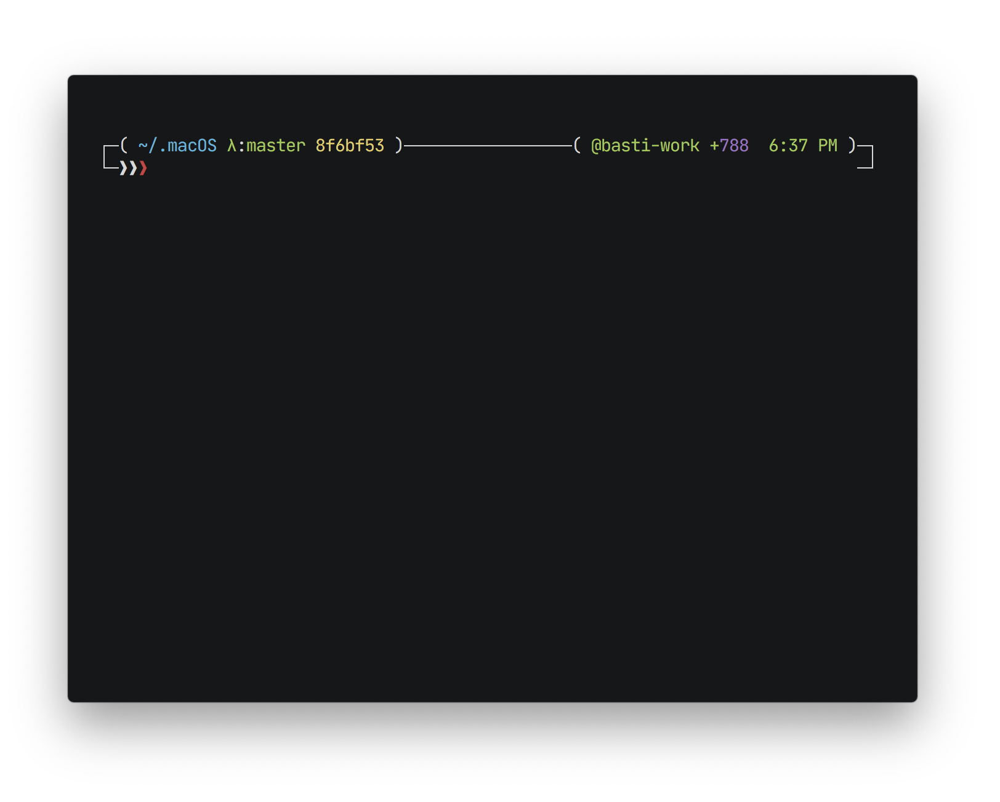

# Dotfiles

Dotfiles that make anywhere feel like `/home`.

## Installation

Run the command below in your terminal and the installation will start *automatically*.

Just follow the prompts and you’ll be fine. 👌

```shell
git clone https://github.com/andikaleonardo/dotfiles.git ~/.dotfiles && ~/.dotfiles/install
```

## 

1. A super 🔥 **Terminal**…

      

    Which is [iTerm2] with

    - [Z-Shell] \(zsh)
    - [JetBrains Mono]  as font
    - [Prezto] with [garrett prompt]
    - [Seti] color scheme

## 

3. A nice stack of (coding optimized 👀) **fonts**…

    - [FiraCode]
    - [CamingoCode]
    - [Anonymous Pro]
    - [Inconsolata]
    - [Inter]
    - [JetBrains Mono]

    <sub>See [`brew/cask/fonts`](brew/casks/fonts) for the full list of fonts that will be installed. Adjust it to your personal taste.</sub>


<!-- Terminal -->
[Z-Shell]: http://www.zsh.org/
[iTerm2]: https://github.com/gnachman/iTerm2
[Prezto]: https://github.com/sorin-ionescu/prezto
[garrett prompt]: https://github.com/chauncey-garrett/zsh-prompt-garrett
[Seti]: https://github.com/mbadolato/iTerm2-Color-Schemes/tree/master/schemes


<!-- Fonts -->
[FiraCode]: https://github.com/tonsky/FiraCode
[CamingoCode]: http://www.janfromm.de/typefaces/camingomono/camingocode/
[Anonymous Pro]: http://www.marksimonson.com/fonts/view/anonymous-pro
[Inconsolata]: http://levien.com/type/myfonts/inconsolata.html
[JetBrains Mono]: https://jetbrains.com/mono
[Inter]: https://rsms.me/inter/
